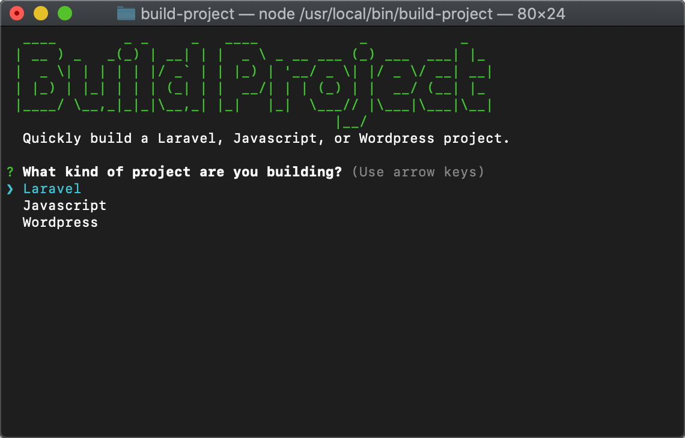

<div align="center">

# Build Project

Opinionated boilerplate setup for all your favorite languages and frameworks.

[](https://travis-ci.com/justintime50/build-project)
[](https://coveralls.io/github/Justintime50/build-project?branch=master)
[](https://www.npmjs.com/package/build-project-tool)
[](LICENSE)



</div>

## What Can it Do?

Build Project can setup a variety of projects for you saving precious time when starting a new project. Build Project has the following features:

1. Create a `new directory`
1. Initiate a `git repo`
1. Generate a `.gitignore file`
1. Generate a `.travis.yml file`
1. Generate a `LICENSE file`
1. Generate a `Dockerfile` & `docker-compose.yml file`
1. Setup your choice of project
    - **Laravel:** Initiate a Laravel project, install packages, publish the storage directory, and scaffold the authentication system.
    - **Node:** Initiate an NPM `package.json` file, `index.js` file, and install ESLint
    - **Python:** Create a `.py` file and a `requirements.txt` file with `pylint` included
    - **Wordpress:** Download and unzip Wordpress
    - **Shell:** Create a script file
    - **Custom:** Build Project will not create an opinionated boilerplate

## Prerequisites

Build Project requires the following for certain features of the tool. Without them, your builds may fail.

- Git
- Node/NPM
- PHP/Composer
- Python
- Curl

## Install

```bash
npm i -g build-project-tool
```

## Usage

Navigate to the folder where you want to create your project, then run the command:

```bash
build-project
```

Follow the prompts to build a variety of projects.

## Development

```shell
# Install the project locally
npm i

# Lint files
npx eslint index.js

# Run tests
npm run test
```
