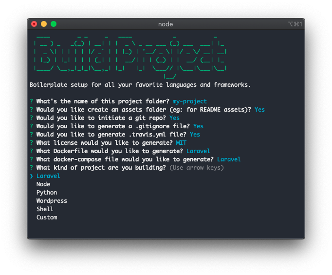

<div align="center">

# Build Project

Setup projects quickly such as Laravel, Node, and Wordpress.

[](https://travis-ci.org/justintime50/build-project)
[](https://opensource.org/licenses/mit-license.php)



</div>

## What Can it Do?

Build Project can setup a variety of projects for you saving precious time when starting a new project. Build Project has the following features:

1. Create a new directory
1. Initiate a Git repo
1. Setup your choice of project
    - Initiate an NPM package.json file, index.js file, ESLint, and install packages
    - Initiate a Laravel project and install packages
    - Download and unzip Wordpress

## Prerequisites

Build Project requires the following for certain pieces of the tool. Without them, your builds may fail.

- Git
- Node/NPM
- PHP/Composer
- Curl

## Install

```bash
npm i -g build-project-tool
```

## Usage

```bash
build-project
```

Follow the prompts to build a variety of projects.

## Roadmap of Feature Set

This project is intended to replace [git-create](https://github.com/Justintime50/git-create) longterm.

General
- Build Readme
- Gitignore
- Travis
- License

Git
- Push to git
- Git login

Node
- Configure eslint

Laravel
- composer.phar

Docker
- Setup docker containers
    - Docker-compose/dockerfile
- Database?
